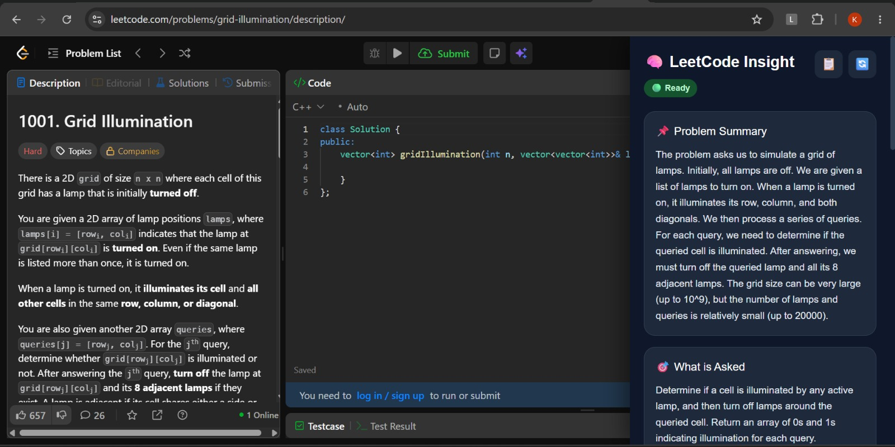
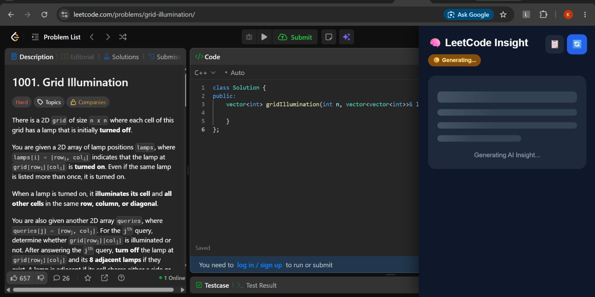
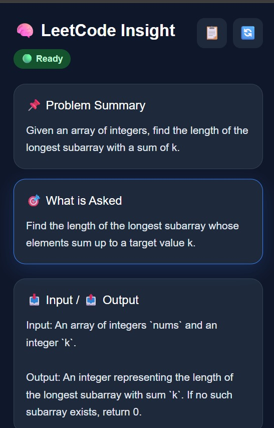

# 🧠 LeetCode Insight

An AI-powered Chrome Extension that analyzes LeetCode problems and provides structured insights such as summaries, problem requirements, constraints, algorithmic patterns, expected complexity, and interview-friendly hints.

Built to help developers understand problems faster without revealing the complete solution.

---

## ✨ Features

- 📌 AI-generated problem summary
- 🎯 Understand what the question is asking
- 📥 Input & Output explanation
- ⚠ Constraint analysis
- 📝 Additional notes
- 🧠 Algorithm pattern detection
- ⏱ Expected Time & Space Complexity
- 💡 Interview-friendly hints (without spoilers)
- 💾 Client-side caching for faster reloads
- 🔄 Regenerate insights anytime
- 🌐 Cloud backend deployed on Render

---

## 📸 Screenshots

> Add screenshots here after capturing them.

### Sidebar




### Loading State




### AI Insights




---

## 🏗️ Project Architecture

```
leetcode-insight-extension/

├── backend/
│   ├── ai.js
│   ├── server.js
│   ├── package.json
│
├── content/
│   ├── api.js
│   ├── cache.js
│   ├── content.js
│   ├── domParser.js
│   └── sidebar.js
│
├── popup/
│   └── popup.html
│
├── styles/
│   └── sidebar.css
│
├── manifest.json
└── README.md
```

---

## ⚙️ Tech Stack

### Frontend

- JavaScript
- HTML
- CSS
- Chrome Extensions API

### Backend

- Node.js
- Express.js
- OpenRouter API

### Deployment

- Render

---

## 🚀 Installation

### 1. Clone Repository

```bash
git clone https://github.com/Kavya-Goyal-kcoder005/leetcode-insight-extension.git
```

---

### 2. Install Backend

```bash
cd backend
npm install
```

---

### 3. Create Environment File

Create a `.env` file inside the backend folder.

```env
OPENROUTER_API_KEY=YOUR_API_KEY
```

---

### 4. Start Backend

```bash
node server.js
```

---

### 5. Load Extension

- Open Chrome
- Navigate to `chrome://extensions`
- Enable **Developer Mode**
- Click **Load unpacked**
- Select the project folder

---

## 🎯 How It Works

1. Open any LeetCode problem.
2. The extension extracts the problem title and description.
3. The data is sent to the backend.
4. The backend queries an LLM via OpenRouter.
5. The AI returns structured JSON.
6. The extension displays the insights in the sidebar.
7. Results are cached locally for faster future access.

---

## 📂 AI Response Format

```json
{
  "summary": "",
  "asked": "",
  "input": "",
  "output": "",
  "constraints": "",
  "notes": "",
  "pattern": "",
  "timeComplexity": "",
  "spaceComplexity": "",
  "hint": ""
}
```

---

## 🌟 Future Improvements

- Floating AI launcher
- Dark/Light theme support
- Multiple AI model selection
- Similar LeetCode problem recommendations
- Company-wise interview insights
- AI chat for follow-up questions
- Bookmark favorite problems
- Learning dashboard

---

## 🤝 Contributing

Contributions, ideas, and feature requests are welcome.

Feel free to fork the repository and submit a pull request.

---

## 👩‍💻 Author

**Kavya Goyal**

GitHub:
https://github.com/Kavya-Goyal-kcoder005

---

## 📄 License

This project is licensed under the MIT License.